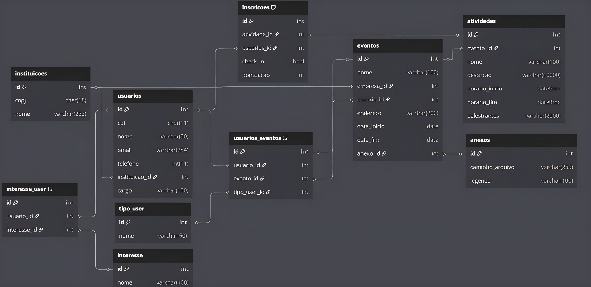
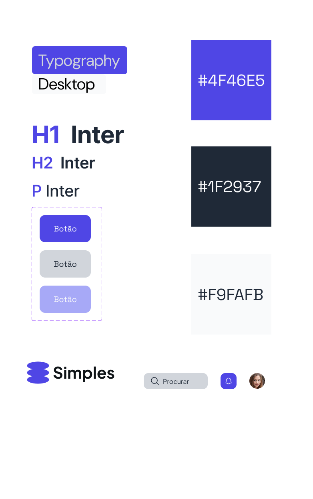
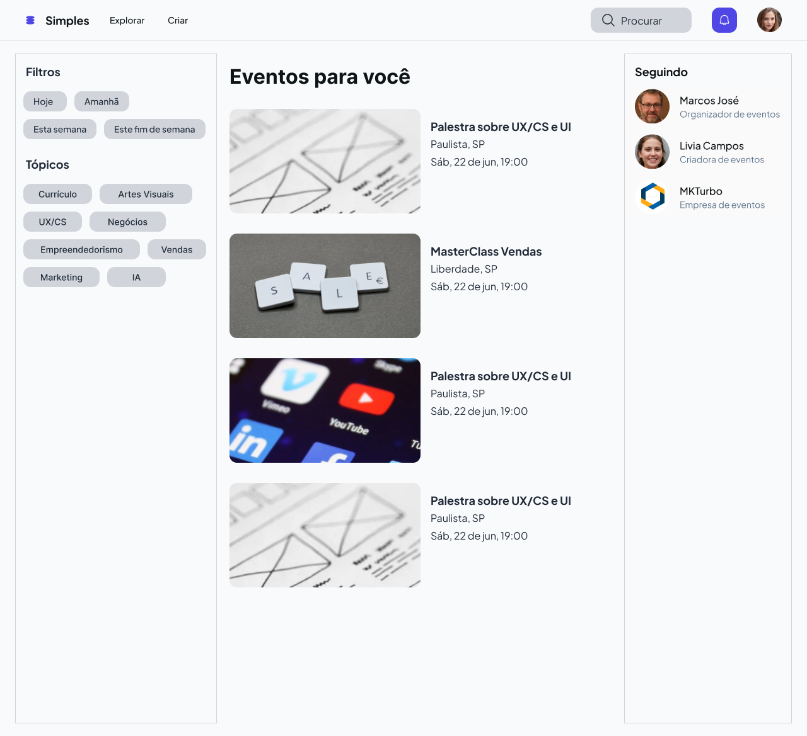
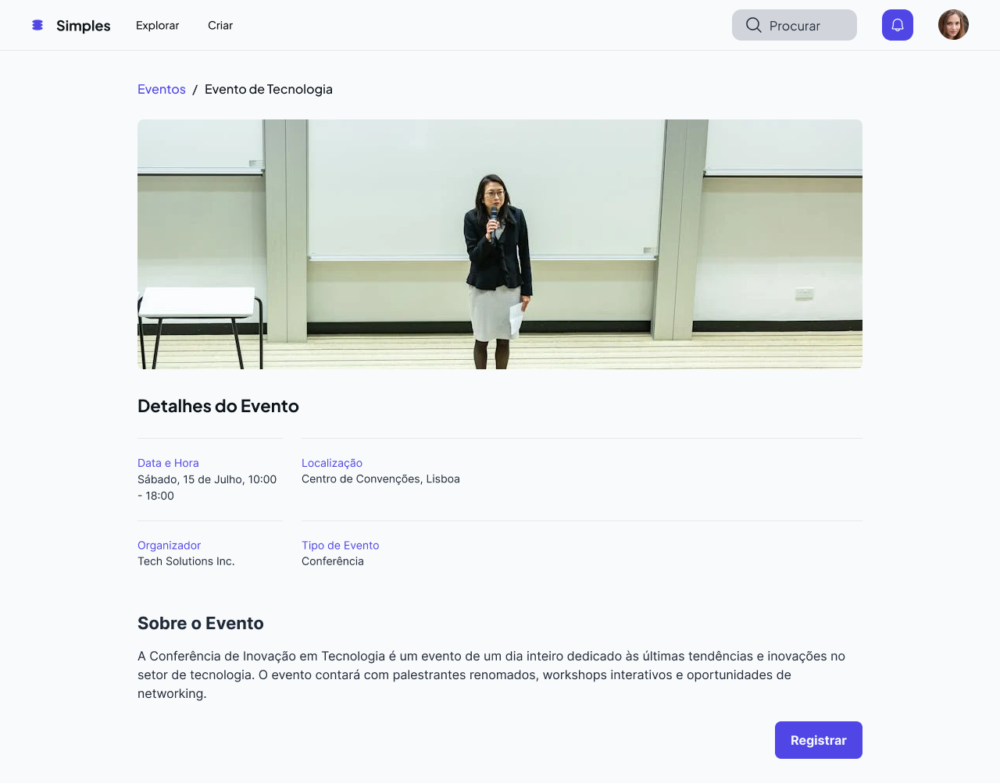
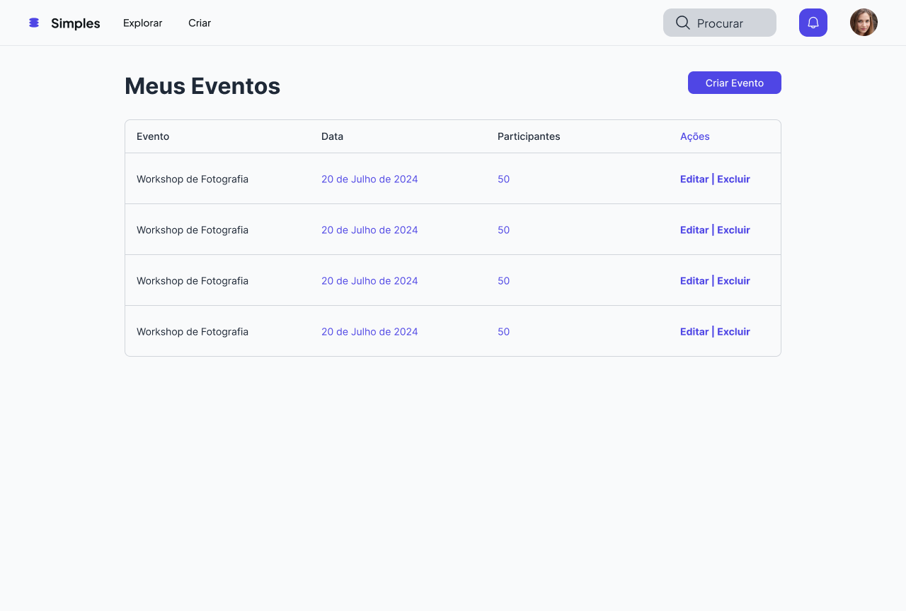
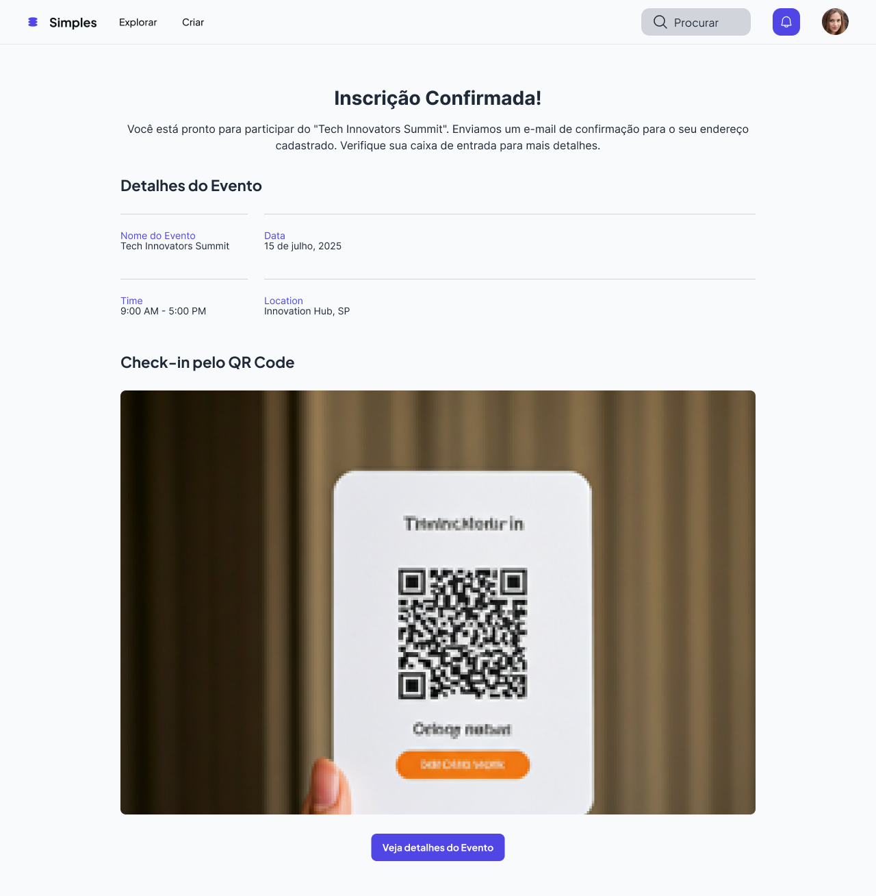

# Web Application Document - Projeto Individual - Módulo 2 - Inteli

## Simples

#### Leunam Sousa de Jesus

## Sumário

1. [Introdução](#c1)  
2. [Visão Geral da Aplicação Web](#c2)  
3. [Projeto Técnico da Aplicação Web](#c3)  
4. [Desenvolvimento da Aplicação Web](#c4)  
5. [Referências](#c5)  

<br>

## <a name="c1"></a>1. Introdução

Esse projeto tem como objetivo o desenvolvimento de uma **plataforma web para gerenciamento de eventos e inscrições**, voltada para oferecer uma experiência prática e organizada tanto para organizadores quanto para participantes. O sistema permitirá a criação e divulgação de eventos, inscrição de usuários com envio automático de e-mails de confirmação, geração de **QR Codes exclusivos** para entrada e um processo de **check-in digital** no local do evento.

Além dessas funcionalidades principais, a plataforma contará com a possibilidade de **exportar listas de presença**, auxiliando na gestão e controle de público, e também com um **minissistema de recompensas baseado em pontuação**. Esse sistema premiará usuários que participarem ativamente dos eventos, incentivando o engajamento contínuo.

Todo o projeto será desenvolvido com foco em **clareza** e **simplicidade**, com o objetivo de garantir uma navegação intuitiva e acessível para qualquer perfil de usuário.

---

## <a name="c2"></a>2. Visão Geral da Aplicação Web

### 2.1. Personas


### 2.2. User Stories

| User Stories | Requisitos | Critérios de Aceite |
|-|-|-|
| US01 | **Como** organizador de eventos, **quero** criar eventos e cadastrar informações (nome, data, local, descrição), **para que** os participantes possam visualizar e se inscrever com facilidade. | - Deve ser possível criar um evento preenchendo nome, data, local e descrição. <br> - O evento deve aparecer na lista de eventos disponíveis para os usuários.<br>- O sistema deve validar se todos os campos obrigatórios foram preenchidos. |
| US02 | **Como** participante, **quero** me inscrever em eventos e receber um QR Code de confirmação por e-mail, **para que** eu possa fazer o check-in rapidamente no dia do evento. | - Deve ser possível realizar a inscrição em um evento com sucesso.<br>- Um e-mail de confirmação deve ser enviado automaticamente para o usuário inscrito.<br>- O e-mail deve conter um QR Code exclusivo para o participante. |
| US03 | **Como** participante frequente, **quero** acumular pontos ao participar dos eventos, **para que** eu possa resgatar recompensas e ser incentivado a continuar participando. | - A cada evento check-in realizado, o usuário deve ganhar pontos no sistema.<br>- Deve ser possível visualizar o saldo de pontos acumulados.<br>- Deve existir uma área para resgatar recompensas disponíveis usando pontos. |

## Análise INVEST da User Story US01

**User Story analisada:**  
*US01 |  Como organizador de eventos, quero criar eventos e cadastrar informações (nome, data, local, descrição), para que os participantes possam visualizar e se inscrever com facilidade.*

### INVEST:

- **I – Independente:**  
  Esta funcionalidade pode ser implementada e testada separadamente, sem depender de outras funcionalidades (como sistema de pontos ou inscrição de eventos).

- **N – Negociável:**  
  Os campos a serem preenchidos na criação do evento podem ser ajustados conforme necessidades futuras (ex: adicionar imagem, categorias).

- **V – Valiosa:**  
  A criação de eventos em uma plataforma é essencial para a gestão do evento por parte dos organizadores além de garantir visibilidade externa para possíveis interessados.

- **E – Estimável:**  
  A criação de formulários e a persistência dos dados no banco de dados podem ser facilmente estimadas em termos de esforço e tempo.

- **S – Pequena:**  
  A User Story é específica e pequena a um processo (criação e exibição do evento), podendo ser desenvolvida em um curto ciclos de desenvolvimento.

- **T – Testável:**  
  Pode-se testar se o organizador consegue criar o evento, se as informações são salvas corretamente e se o evento aparece para os participantes.

---

## <a name="c3"></a>3. Projeto da Aplicação Web

### 3.1. Modelagem do banco de dados

1. Introdução

A plataforma de eventos foi desenvolvida com o objetivo de gerenciar eventos e inscrições de participantes. O sistema permite que administradores cadastrem eventos e acompanhem as inscrições realizadas por usuários. O foco do projeto é oferecer uma interface simples e funcional para organização e participação em eventos.

2. Diagrama Lógico do Banco de Dados



3. Tabelas e Atributos

**Instituições (`instituicoes`)**
- `id`: Identificador único da instituição (PK)
- `cnpj`: CNPJ da instituição (único)
- `nome`: Nome da instituição  
**Relação**: Uma instituição pode estar associada a vários usuários e eventos (1:N).

**Usuários (`usuarios`)**
- `id`: Identificador único do usuário (PK)
- `cpf`: CPF do usuário (único)
- `nome`: Nome completo
- `email`: Endereço de e-mail (único)
- `telefone`: Telefone de contato
- `instituicao_id`: FK para a tabela `instituicoes`
- `cargo`: Cargo que ocupa na instituição  
**Relação**:
- Cada usuário pertence a uma instituição (N:1).
- Um usuário pode participar de vários eventos e atividades (N:M).

**Tipo de Usuário (`tipo_user`)**
- `id`: Identificador único do tipo (PK)
- `nome`: Ex: Participante, Organizador, Palestrante  
**Relação**: Cada relação entre usuário e evento é tipada por um valor dessa tabela (1:N).

**Interesses (`interesse`)**
- `id`: Identificador único (PK)
- `nome`: Nome do interesse (ex: tecnologia, saúde)  
**Relação**: Utilizada para associar usuários a temas de interesse (N:M via `interesse_user`).

**Interesse do Usuário (`interesse_user`)**
- `id`: Identificador único (PK)
- `usuario_id`: FK para `usuarios`
- `interesse_id`: FK para `interesse`  
**Observação**: Cada usuário pode ter um ou mais interesses.  
**Relação**: N:M entre `usuarios` e `interesse`.

**Eventos (`eventos`)**
- `id`: Identificador do evento (PK)
- `nome`: Título do evento
- `empresa_id`: FK para `instituicoes`
- `usuario_id`: FK para `usuarios_eventos` (responsável)
- `endereco`: Endereço onde ocorrerá
- `data_inicio`: Data de início
- `data_fim`: Data de término
- `anexo_id`: FK para `anexos`  
**Relação**:
- Um evento pertence a uma instituição e pode ter vários usuários e atividades (1:N).
- Eventos e usuários se relacionam via `usuarios_eventos`.

**Usuários e Eventos (`usuarios_eventos`)**
- `id`: Identificador único (PK)
- `usuario_id`: FK para `usuarios`
- `evento_id`: FK para `eventos`
- `tipo_user_id`: FK para `tipo_user`  
**Observação**: Controla o papel de cada usuário em cada evento.  
**Relação**: N:M entre `usuarios` e `eventos`.

---

**Anexos (`anexos`)**
- `id`: Identificador único (PK)
- `caminho_arquivo`: Localização do arquivo
- `legenda`: Descrição do anexo  
**Relação**: Um anexo pode estar vinculado a um evento (1:1).

**Atividades (`atividades`)**
- `id`: Identificador único (PK)
- `evento_id`: FK para `eventos`
- `nome`: Título da atividade
- `descricao`: Descrição detalhada
- `horario_inicio`: Data e hora de início
- `horario_fim`: Data e hora de fim
- `palestrantes`: Campo de texto com nomes  
**Relação**: Cada evento pode ter várias atividades (1:N).

**Inscrições (`inscricoes`)**
- `id`: Identificador único (PK)
- `atividade_id`: FK para `atividades`
- `usuarios_id`: FK para `usuarios`
- `check_in`: Booleano que indica presença
- `pontuacao`: Pontuação adquirida  
**Relação**: N:M entre `usuarios` e `atividades`.

4. Cardinalidade das Relações

- **Instituição → Usuários**: 1:N  
- **Usuário → Eventos (via usuários_eventos)**: N:M  
- **Usuário → Atividades (via inscrições)**: N:M  
- **Usuário → Interesses (via interesse_user)**: N:M  
- **Evento → Atividades**: 1:N  
- **Evento → Anexo**: 1:1  
- **Usuário_Evento → Tipo de Usuário**: 1:N

Essa modelagem atende as regras de negócio do sistema proposto, permitindo controle de usuários, criação de eventos e gerenciamento das inscrições com integridade e clareza.

5. Modelo Físico – Schema do Banco de Dados

O arquivo abaixo contém todas as instruções SQL para a criação do banco de dados da plataforma de eventos:

📄 **Arquivo .SQL com o schema:**  
```
CREATE EXTENSION IF NOT EXISTS "uuid-ossp";

CREATE TABLE instituicoes (
  id SERIAL PRIMARY KEY,
  cnpj CHAR(18) UNIQUE,
  nome VARCHAR(255)
);

CREATE TABLE usuarios (
  id SERIAL PRIMARY KEY,
  cpf CHAR(11) UNIQUE,
  nome VARCHAR(50),
  email VARCHAR(254) UNIQUE,
  telefone BIGINT,
  instituicao_id INT REFERENCES instituicoes(id),
  cargo VARCHAR(100)
);

CREATE TABLE interesse (
  id SERIAL PRIMARY KEY,
  nome VARCHAR(100)
);

CREATE TABLE tipo_user (
  id SERIAL PRIMARY KEY,
  nome VARCHAR(50)
);

CREATE TABLE interesse_user (
  id SERIAL PRIMARY KEY,
  usuario_id INT REFERENCES usuarios(id),
  interesse_id INT REFERENCES interesse(id),
  UNIQUE(usuario_id, interesse_id)
);

CREATE TABLE anexos (
  id SERIAL PRIMARY KEY,
  caminho_arquivo VARCHAR(255),
  legenda VARCHAR(100)
);

CREATE TABLE eventos (
  id SERIAL PRIMARY KEY,
  nome VARCHAR(100),
  empresa_id INT REFERENCES instituicoes(id),
  usuario_id INT, -- Reflete o organizador, que está na tabela usuarios_eventos
  endereco VARCHAR(200),
  data_inicio DATE,
  data_fim DATE,
  anexo_id INT REFERENCES anexos(id)
);

CREATE TABLE usuarios_eventos (
  id SERIAL PRIMARY KEY,
  usuario_id INT REFERENCES usuarios(id),
  evento_id INT REFERENCES eventos(id),
  tipo_user_id INT REFERENCES tipo_user(id),
  UNIQUE(usuario_id, evento_id)
);

CREATE TABLE atividades (
  id SERIAL PRIMARY KEY,
  evento_id INT REFERENCES eventos(id),
  nome VARCHAR(100),
  descricao TEXT,
  horario_inicio TIMESTAMP,
  horario_fim TIMESTAMP,
  palestrantes VARCHAR(2000)
);

CREATE TABLE inscricoes (
  id SERIAL PRIMARY KEY,
  atividade_id INT REFERENCES atividades(id),
  usuarios_id INT REFERENCES usuarios(id),
  check_in BOOLEAN,
  pontuacao INT,
  UNIQUE(usuarios_id, atividade_id)
);
```

### ✅ Instruções básicas para execução:

1. Abra o seu SGBD (ex: MySQL Workbench, pgAdmin, DBeaver).
2. Crie um banco de dados novo.
3. Execute o conteúdo do arquivo `.sql` para criar todas as tabelas com as relações corretamente definidas.

---

### 3.1.1 BD e Models (Semana 5)
*Descreva aqui os Models implementados no sistema web*

### 3.2. Arquitetura (Semana 5)

*Posicione aqui o diagrama de arquitetura da sua solução de aplicação web. Atualize sempre que necessário.*

**Instruções para criação do diagrama de arquitetura**  
- **Model**: A camada que lida com a lógica de negócios e interage com o banco de dados.
- **View**: A camada responsável pela interface de usuário.
- **Controller**: A camada que recebe as requisições, processa as ações e atualiza o modelo e a visualização.
  
*Adicione as setas e explicações sobre como os dados fluem entre o Model, Controller e View.*

### 3.3. Wireframes

A seguir, apresento os wireframes das principais funcionalidades da plataforma, diretamente relacionados às User Stories (US) descritas anteriormente.

#### Tela de Participante

**Relação com US**:

- **US02**: Como participante, desejo visualizar detalhes de um evento e me inscrever em atividades específicas.
- A tela mostra as informações do evento de forma acessível, com opção de inscrição por atividade.


#### Tela de Criação de Evento:


**Relação com US**:
- **US01**: Como organizador, desejo criar um evento com nome, descrição, data e atividades, para divulgar e permitir inscrições.
- Esta tela permite ao organizador inserir as informações principais do evento e estruturar sua programação.

#### Tela de Gerenciamento de Evento


**Relação com US**:
- **US01**: Como organizador, desejo gerenciar os dados do meu evento, visualizar inscritos e atualizar informações.
- A interface permite acesso às inscrições, edição do evento e acompanhamento da participação em tempo real.

[Link Complementar (Figma)](https://www.figma.com/design/Zhon5TjMIgSFq4zLD4IwnW/Projeto-Individual?node-id=0-1&t=6RkaWsnYNhUCVPaO-1)

### 3.4. Guia de estilos

Este guia de estilos foi desenvolvido para garantir consistência visual, legibilidade e uma experiência amigável aos usuários do sistema de gerenciamento de eventos.

**Guia de Estilos**


---

### 3.5. Protótipo de alta fidelidade

A seguir, imagens do protótipo de alta fidelidade da solução, que refletem as funcionalidades principais conforme definido nas User Stories e wireframes.

#### 🖼 Telas demonstrativas

**Tela de criar conta**


**Tela de Eventos**


**Tela de Detalhes do Evento**


**Tela de criação de evento**


**Tela de gerenciamento de eventos**


**Tela de inscrição com QR Code**


> **Acesse o protótipo completo aqui:**
> [Protótipo Figma – Projeto Individual](https://www.figma.com/design/Zhon5TjMIgSFq4zLD4IwnW/Projeto-Individual?node-id=3332-556&t=2dYIhfYo43IedMCw-1)


### 3.6. WebAPI e endpoints (Semana 05)

*Utilize um link para outra página de documentação contendo a descrição completa de cada endpoint. Ou descreva aqui cada endpoint criado para seu sistema.*  

### 3.7 Interface e Navegação (Semana 07)

*Descreva e ilustre aqui o desenvolvimento do frontend do sistema web, explicando brevemente o que foi entregue em termos de código e sistema. Utilize prints de tela para ilustrar.*

---

## <a name="c4"></a>4. Desenvolvimento da Aplicação Web (Semana 8)

### 4.1 Demonstração do Sistema Web (Semana 8)

*VIDEO: Insira o link do vídeo demonstrativo nesta seção*
*Descreva e ilustre aqui o desenvolvimento do sistema web completo, explicando brevemente o que foi entregue em termos de código e sistema. Utilize prints de tela para ilustrar.*

### 4.2 Conclusões e Trabalhos Futuros (Semana 8)

*Indique pontos fortes e pontos a melhorar de maneira geral.*
*Relacione também quaisquer outras ideias que você tenha para melhorias futuras.*


## <a name="c5"></a>5. Referências

_Incluir as principais referências de seu projeto, para que seu parceiro possa consultar caso ele se interessar em aprofundar. Um exemplo de referência de livro e de site:_<br>

---
---