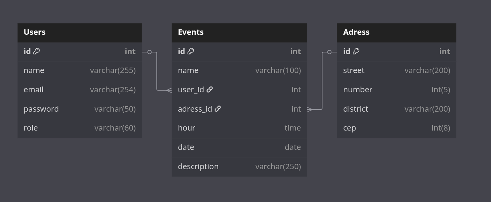
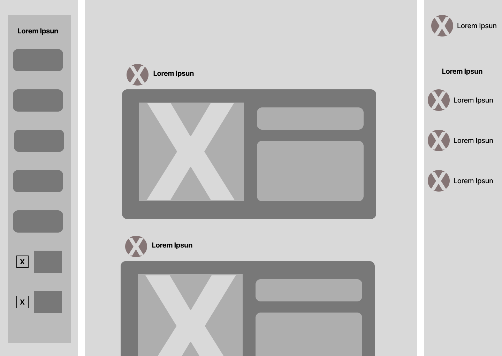
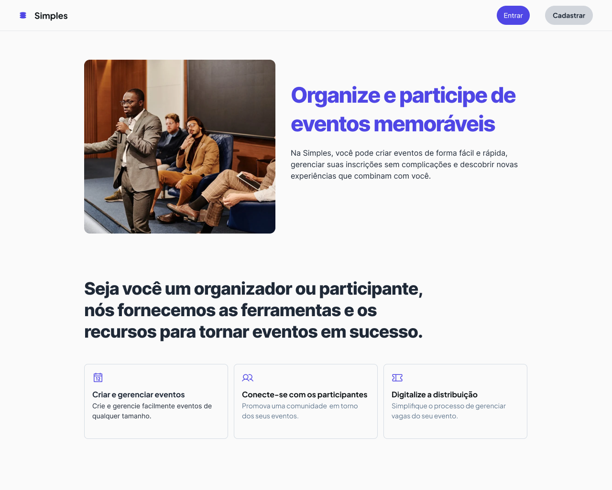
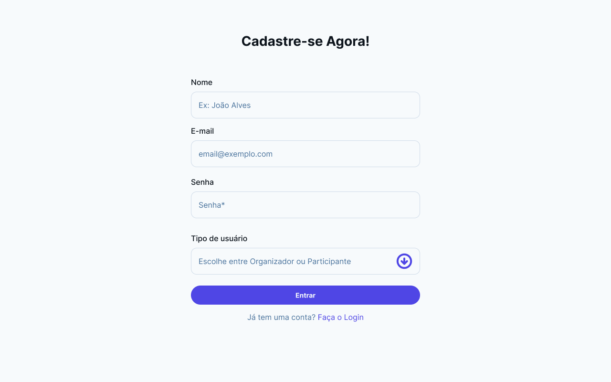
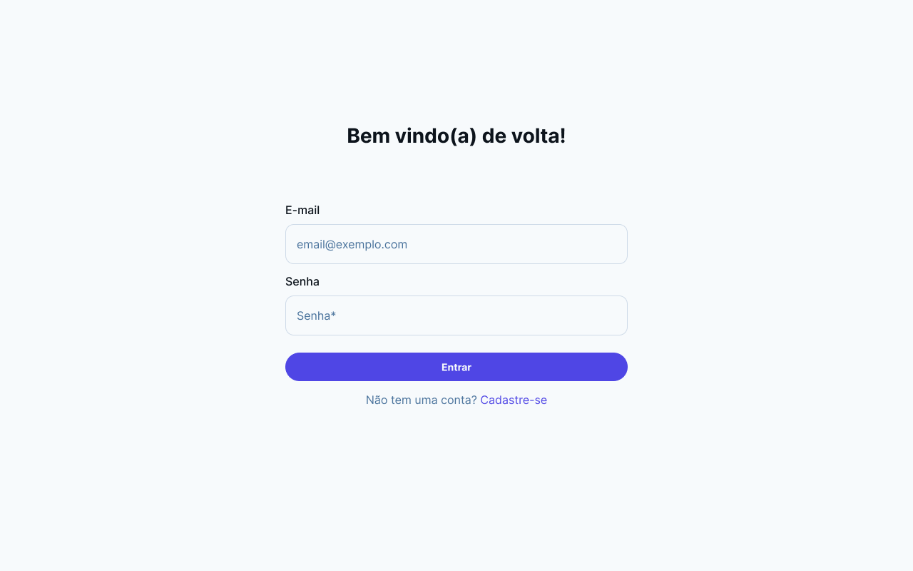
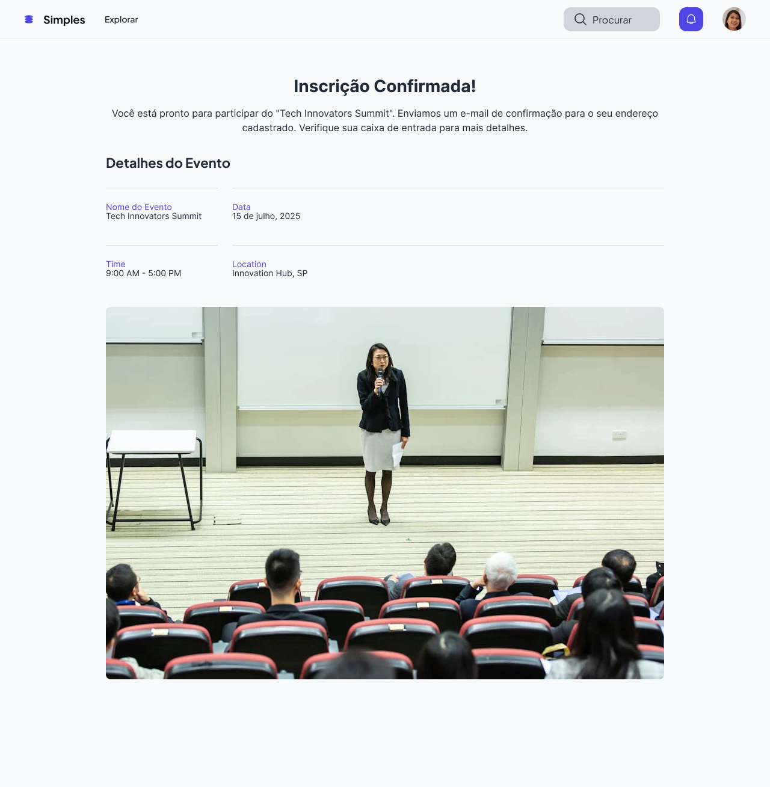
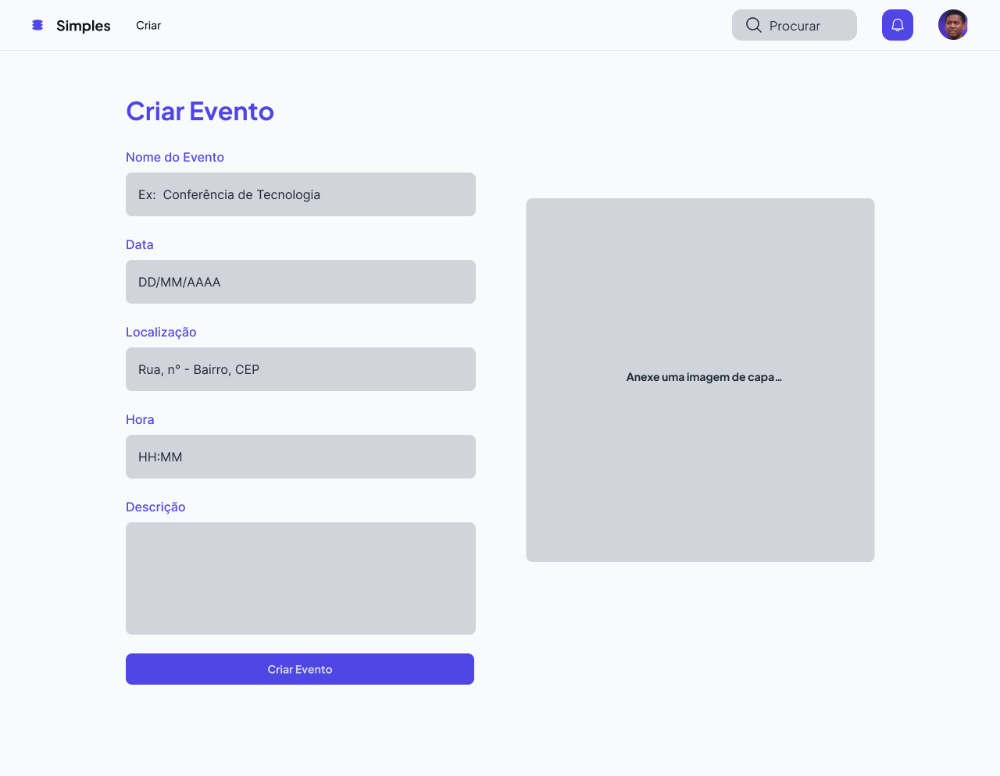

# Web Application Document - Projeto Individual - Módulo 2 - Inteli

## 🟪 Simples

#### Leunam Sousa de Jesus

## Sumário

1. [Introdução](#c1)
2. [Visão Geral da Aplicação Web](#c2)
3. [Projeto Técnico da Aplicação Web](#c3)
4. [Desenvolvimento da Aplicação Web](#c4)
5. [Referências](#c5)

<br>

## <a name="c1"></a>1. Introdução

Esse projeto tem como objetivo o desenvolvimento de uma **plataforma web para gerenciamento de eventos e inscrições**, voltada para oferecer uma experiência prática e organizada tanto para organizadores quanto para participantes. O sistema permitirá a criação e inscrição de usuários em eventos.

Todo o projeto será desenvolvido com foco em **clareza** e **simplicidade**, com o objetivo de garantir uma navegação intuitiva e acessível para qualquer perfil de usuário.

---

## <a name="c2"></a>2. Visão Geral da Aplicação Web

### 2.1. Personas


### 2.2. User Stories

| User Stories | Requisitos                                                                                                                                                                                             | Critérios de Aceite                                                                                                                                                                                                                           |
| ------------ | ------------------------------------------------------------------------------------------------------------------------------------------------------------------------------------------------------ | --------------------------------------------------------------------------------------------------------------------------------------------------------------------------------------------------------------------------------------------- |
| US01         | **Como** organizador de eventos, **quero** criar eventos e cadastrar informações (nome, data, local, hora e descrição), **para que** os participantes possam visualizar e se inscrever com facilidade. | - Deve ser possível criar um evento preenchendo nome, data, local e descrição. <br> - O evento deve aparecer na lista de eventos disponíveis para os usuários.<br>- O sistema deve validar se todos os campos obrigatórios foram preenchidos. |
| US02         | **Como** participante, **quero** visualizar e me inscrever em eventos, **para que** eu possa participar das atividades de interesse.                                                                   | - Deve ser possível visualizar todos os eventos disponíveis.<br>- Deve ser possível realizar a inscrição em um evento com sucesso.<br> - A inscrição deve ser confirmada e armazenada no sistema.                                             |
| US03         | **Como** participante, **quero** receber uma confirmação da inscrição **para que** eu saiba que estou participando do evento.                                                                          | - Após a inscrição, deve ser possível visualizar uma confirmação.<br>- O status de "se inscrever" deve mudar para "inscrito".<br>                                                                                                             |

## Análise INVEST da User Story US01

**User Story analisada:**  
_US01 | Como organizador de eventos, quero criar eventos e cadastrar informações (nome, data, local, descrição), para que os participantes possam visualizar e se inscrever com facilidade._

### INVEST:

- **I – Independente:**  
  Esta funcionalidade pode ser implementada e testada separadamente, sem depender de outras funcionalidades (inscrição de eventos).

- **N – Negociável:**  
  Os campos a serem preenchidos na criação do evento podem ser ajustados conforme necessidades futuras (ex: adicionar imagem, categorias).

- **V – Valiosa:**  
  A criação de eventos em uma plataforma é essencial para a gestão do evento por parte dos organizadores além de garantir visibilidade externa para possíveis interessados.

- **E – Estimável:**  
  A criação de formulários e a persistência dos dados no banco de dados podem ser facilmente estimadas em termos de esforço e tempo.

- **S – Pequena:**  
  A User Story é específica e pequena a um processo (criação e exibição do evento), podendo ser desenvolvida em um curto ciclos de desenvolvimento.

- **T – Testável:**  
  Pode-se testar se o organizador consegue criar o evento, se as informações são salvas corretamente e se o evento aparece para os participantes.

---

## <a name="c3"></a>3. Projeto da Aplicação Web

### 3.1. Modelagem do banco de dados

#### 1. Introdução

O banco de dados foi modelado e projetado em PostgreSQL para atender às principais necessidades da aplicação, permitindo o gerenciamento de usuários, endereços e eventos.

#### 2. Diagrama Lógico do Banco de Dados



#### 3. Tabelas e Atributos

**Usuários (`users`)**

- `id`: Identificador único do usuário (PK)
- `name`: Nome completo do usuário
- `email`: E-mail único do usuário (usado para login)
- `password`: Senha de acesso
- `role`: Tipo do usuário na plataforma (`organizador` ou `participante`)

---

### **Endereços (`address`)**

- `id`: Identificador único do endereço (PK)
- `street`: Nome da rua
- `number`: Número do local
- `district`: Bairro
- `cep`: Código postal (CEP)

---

### **Eventos (`events`)**

- `id`: Identificador único do evento (PK)
- `name`: Título do evento
- `user_id`: FK para o usuário responsável pelo evento (organizador)
- `address_id`: FK para o endereço do evento
- `event_time`: Horário do evento
- `event_date`: Data de realização do evento
- `description`: Descrição detalhada do evento (opcional)

#### 4. Cardinalidade das Relações

- **Usuário → Eventos**: 1:N - Um usuário pode ser responsável por vários eventos.
- **Endereço → Eventos**: 1:N - Um endereço pode estar vinculado a vários eventos.

#### 5. Modelo Físico – Schema do Banco de Dados

O arquivo abaixo contém todas as instruções SQL para a criação do banco de dados:

**Arquivo .SQL com o schema:**

```
CREATE TABLE Users (
  id SERIAL PRIMARY KEY,
  name VARCHAR(255) NOT NULL,
  email VARCHAR(254) UNIQUE NOT NULL,
  password VARCHAR(255) NOT NULL,
  role VARCHAR(60) NOT NULL
);

CREATE TABLE Address (
  id SERIAL PRIMARY KEY,
  street VARCHAR(200) NOT NULL,
  number INT NOT NULL,
  district VARCHAR(200) NOT NULL,
  cep VARCHAR(10) NOT NULL
);

CREATE TABLE Events (
  id SERIAL PRIMARY KEY,
  name VARCHAR(100) NOT NULL,
  user_id INT NOT NULL REFERENCES Users(id) ON DELETE CASCADE,
  address_id INT NOT NULL REFERENCES Address(id) ON DELETE CASCADE,
  event_time TIME NOT NULL,
  event_date DATE NOT NULL,
  description VARCHAR(250)
);
```

---

### 3.1.1 BD e Models

O sistema implementa três models principais que refletem a estrutura do banco de dados PostgreSQL:

1. **User Model**

   - Responsável pelo gerenciamento de usuários
   - Atributos: id, name, email, password, role
   - Métodos principais:
     - `createUser`: Cria novo usuário
     - `findByEmail`: Busca usuário por email
     - `updateUser`: Atualiza dados do usuário
     - `deleteUser`: Remove usuário do sistema

2. **Event Model**

   - Gerencia os eventos da plataforma
   - Atributos: id, name, user_id, address_id, event_time, event_date, description
   - Métodos principais:
     - `createEvent`: Cria novo evento
     - `getAllEvents`: Lista todos os eventos
     - `getEventById`: Busca evento específico
     - `updateEvent`: Atualiza informações do evento
     - `deleteEvent`: Remove evento do sistema

3. **Address Model**
   - Gerencia os endereços dos eventos
   - Atributos: id, street, number, district, cep
   - Métodos principais:
     - `createAddress`: Cria novo endereço
     - `getAddressById`: Busca endereço específico
     - `updateAddress`: Atualiza informações do endereço
     - `deleteAddress`: Remove endereço do sistema

**Implementação do Banco de Dados:**

- Utilização do PostgreSQL como SGBD
- Conexão estabelecida através do Knex.js
- Migrations implementadas para versionamento do banco
- Dados iniciais de teste

**Migrations Implementadas:**

1. Criação da tabela de usuários
2. Criação da tabela de endereços
3. Criação da tabela de eventos
4. Adição de chaves estrangeiras e relacionamentos

### 3.2. Arquitetura

A aplicação segue a arquitetura MVC (Model-View-Controller), implementada da seguinte forma:


**Fluxo de Dados na Arquitetura:**

1. **Model:**

   - Implementa a lógica de negócios
   - Gerencia o acesso ao banco de dados PostgreSQL
   - Utiliza Knex.js para queries e migrations
   - Mantém a integridade dos dados

2. **View:**

   - Interface do usuário em HTML/CSS/JavaScript
   - Renderização dinâmica de conteúdo
   - Formulários para interação com usuário
   - Exibição de feedback e mensagens

3. **Controller:**
   - Processa requisições HTTP
   - Implementa a lógica de rotas
   - Gerencia autenticação e autorização
   - Coordena a comunicação entre Model e View

**Componentes Adicionais:**

- **Routes:** Gerenciamento de rotas da aplicação

### 3.3. Wireframes

A seguir, apresento os wireframes das principais funcionalidades da plataforma, diretamente relacionados às User Stories (US) descritas anteriormente.

#### Tela de Participante


**Relação com US**:

- **US02**: Como participante, quero visualizar e me inscrever em eventos.
- A tela mostra as informações do evento de forma acessível, com opção de inscrição ou visualização.

#### Tela de Criação de Evento:


**Relação com US**:

- **US01**: Como organizador de eventos, quero criar eventos e cadastrar informações (nome, data, local, hora e descrição)
- Esta tela permite ao organizador inserir as informações principais do evento e estruturar sua programação.

#### Tela de Confirmação de Inscrição


**Relação com US**:

- **US02**: Como participante, quero receber uma confirmação da inscrição.
- A interface permite acessar as informações do evento e acompanhar elas em tempo real.

[Link Complementar (Figma)](https://www.figma.com/design/Zhon5TjMIgSFq4zLD4IwnW/Projeto-Individual?node-id=0-1&t=6RkaWsnYNhUCVPaO-1)

### 3.4. Guia de estilos

Este guia de estilos foi desenvolvido para garantir consistência visual, legibilidade e uma experiência amigável aos usuários do sistema de gerenciamento de eventos.


---

### 3.5. Protótipo de alta fidelidade

A seguir, imagens do protótipo de alta fidelidade da solução, que refletem as funcionalidades principais conforme definido nas User Stories e wireframes.

#### 🖼 Telas demonstrativas

**Tela de Dashboard**


**Tela de criar conta**


**Tela de login da conta**


**Tela de Visualizar Eventos**


**Tela de Detalhes do Evento**


**Tela de confirmação inscrição**


**Tela de criação de evento**


**Tela de gerenciamento de eventos**


> **Acesse o protótipo completo aqui:** > [Protótipo Figma – Projeto Individual](https://www.figma.com/design/Zhon5TjMIgSFq4zLD4IwnW/Projeto-Individual?node-id=3332-556&t=2dYIhfYo43IedMCw-1)

### 3.6. WebAPI e endpoints

O sistema de gerenciamento de eventos implementa uma API REST completa, organizada em três módulos principais: **Users**, **Events** e **Address**. A API oferece endpoints tanto para operações CRUD (Create, Read, Update, Delete) quanto para a interface web da aplicação.

#### Estrutura da API

A API está estruturada da seguinte forma:

- **Base URL:** `http://localhost:3000`
- **Endpoints de API:** Prefixo `/api` - Retornam dados em formato JSON
- **Endpoints Web:** Sem prefixo - Renderizam páginas HTML com EJS

#### Módulos Principais

**1. Usuários (`/api/users`)**

- Gerenciamento completo de usuários (organizadores e participantes)
- Autenticação baseada em sessões
- Endpoints para CRUD de usuários

**2. Eventos (`/api/events`)**

- Criação, listagem, edição e exclusão de eventos
- Associação com usuários organizadores e endereços
- Gerenciamento de inscrições

**3. Endereços (`/api/address`)**

- Cadastro e gerenciamento de locais dos eventos
- Validação de dados de endereço (CEP, rua, número, bairro)

#### Autenticação e Autorização

O sistema utiliza **sessões do Express** para manter o estado de autenticação dos usuários. Após o login bem-sucedido, as informações do usuário são armazenadas na sessão e utilizadas para:

- Autorizar operações em eventos (apenas organizadores podem editar/excluir seus próprios eventos)
- Personalizar a experiência do usuário
- Controlar acesso a páginas protegidas

#### Principais Endpoints

**Autenticação:**

- `POST /login` - Autenticação de usuário
- `POST /register` - Cadastro de novo usuário

**Gestão de Eventos:**

- `GET /eventos` - Listagem pública de eventos
- `POST /criarEvento` - Criação de novo evento
- `GET /evento/:id/editar` - Edição de evento
- `POST /evento/:id/inscrever` - Inscrição em evento

**API REST:**

- `GET /api/events` - Lista eventos (JSON)
- `POST /api/events` - Cria evento (JSON)
- `PUT /api/events/:id` - Atualiza evento (JSON)
- `DELETE /api/events/:id` - Remove evento (JSON)

#### Documentação Completa

Para uma descrição detalhada de todos os endpoints, incluindo parâmetros, exemplos de requisições e respostas, códigos de status HTTP e casos de uso, consulte:

**[Documentação Completa de Endpoints](./endpoints.md)**

A documentação inclui:

- Descrição detalhada de cada endpoint
- Exemplos de requisições e respostas JSON
- Códigos de status HTTP
- Exemplos práticos com cURL
- Notas técnicas sobre implementação

### 3.7 Interface e Navegação (Semana 07)

_Descreva e ilustre aqui o desenvolvimento do frontend do sistema web, explicando brevemente o que foi entregue em termos de código e sistema. Utilize prints de tela para ilustrar._

---

## <a name="c4"></a>4. Desenvolvimento da Aplicação Web (Semana 8)

### 4.1 Demonstração do Sistema Web (Semana 8)

_VIDEO: Insira o link do vídeo demonstrativo nesta seção_
_Descreva e ilustre aqui o desenvolvimento do sistema web completo, explicando brevemente o que foi entregue em termos de código e sistema. Utilize prints de tela para ilustrar._

### 4.2 Conclusões e Trabalhos Futuros (Semana 8)

_Indique pontos fortes e pontos a melhorar de maneira geral._
_Relacione também quaisquer outras ideias que você tenha para melhorias futuras._

## <a name="c5"></a>5. Referências

_Incluir as principais referências de seu projeto, para que seu parceiro possa consultar caso ele se interessar em aprofundar. Um exemplo de referência de livro e de site:_<br>

---

---
